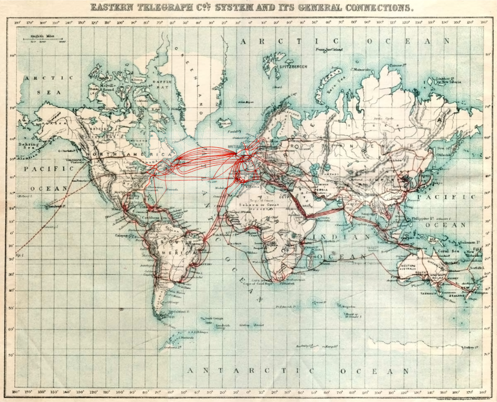

# Ping

Learn to explain how computers send information to each other.

[Video Alternative](https://www.youtube.com/watch?v=wAE-VFCr_dQ&t=0s)

## The question: How do computers communicate?

To answer this question we need to go further back. In fact, we need to go back
two hundred years! To the invention of the electric telegraph.

The electric telegraph was a way of sending messages over long distances using
electrical signals. They would make a very long metal wire and run an electric
current through it. This could be detected at the other end. 

Through systems like Morse code, which involves tapping on a single key to
create patterns of long and short signals, then translated into long and short
beeps, alphabetical messages could be sent.

<details>
  <summary>:speech_balloon: That must have been very exciting! Tell me more.</summary>

  ---

  It may surprise you to know that this took a while to catch on. At the time,
  people were very used to using semaphore. Semaphore telegraphy is the process
  of relaying messages through people on high hills and mountains using flags or
  machines. One person would make the symbol, and another a distance away would
  be watching them and then relay the symbol along. There are other systems like
  the use of drums and fires throughout history in a number of cultures.

  Because this was slow and expensive, practically the fastest way of sending
  ordinary information before the invention of the electric telegraph was the
  railway. This led to an interesting result: if someone committed a crime and
  then caught the train shortly after, it was essentially impossible to catch
  them!

  In part due to the fact that rail was the best form of information
  transmission in that era, most of these early telegraphy wires were along
  railway lines.

  ---

</details>

In the 1850s some enterprising people had the idea that they could lay a gigantic
submarine cable connecting the United Kingdom (via Ireland) and the United
States (via Canada).


This was a major endeavour at the time and worked very poorly. Nonetheless, they
sent an early few messages, and Queen Victoria and President James Buchanan
exchanged some messages. Here is a quote from the President's message, sent
August 19th 1858:

> It is a triumph more glorious, because far more useful to mankind, than was
> ever won by conqueror on the field of battle. May the Atlantic telegraph,
> under the blessing of Heaven, prove to be a bond of perpetual peace and
> friendship between the kindred nations, and an instrument destined by Divine
> Providence to diffuse religion, civilization, liberty, and law throughout the
> world.

[If you want to hear this in Morse code you can paste it in here and hit
play.](https://morsecode.world/international/translator.html)

The next day, New York sounded 100 guns, hung the streets with flags, and rang
church bells. A few weeks later there was a parade, a torchlight procession, and
a fireworks display.


It is hard to overstate the impact of this moment in human history!

The cable then proceeded to fail entirely, and the second they attempted to lay
to replace it broke and fell into the sea. The third was more successful and
since then human civilisation has been linked together by the electric cable.



When computers came along, the first tool to connect them was the simple cable,
combined with a common set of principles for sending information over those
cables (a 'protocol').

Let's now look at a tool reminiscent of that era.

## The tool: Ping

Run `man ping` in the terminal and you'll see something like this:

```
PING(8)                      System Manager's Manual                     PING(8)

NAME
     ping – send ICMP ECHO_REQUEST packets to network hosts

SYNOPSIS
     ping [-AaCDdfnoQqRrv] [-b boundif] [-c count] [-G sweepmaxsize] 
          [-g sweepminsize] [-h sweepincrsize] [-i wait] [-k trafficclass]
          [-K netservicetype] [-l preload] [-M mask | time] [-m ttl] [-P policy]
          [-p pattern] [-S src_addr] [-s packetsize] [-t timeout]
          [-W waittime] [-z tos] [--apple-connect] [--apple-time] host
     ping [-AaDdfLnoQqRrv] [-b boundif] [-c count] [-I iface] [-i wait] 
          [-k trafficclass] [-K netservicetype] [-l preload]
          [-M mask | time] [-m ttl] [-P policy] [-p pattern] [-S src_addr] 
          [-s packetsize] [-T ttl] [-t timeout] [-W waittime] [-z tos]
          [--apple-connect] [--apple-time] mcast-group

DESCRIPTION
     The ping utility uses the ICMP protocol's mandatory ECHO_REQUEST datagram
     to elicit an ICMP ECHO_RESPONSE from a host or gateway. ECHO_REQUEST 
     datagrams ("pings") have an IP and ICMP header, followed by a "struct 
     timeval" and then an arbitrary number of "pad" bytes used to fill out
     the packet.
```

There's a lot going on there! It may not be so easy to understand yet. Let's try
running it. We're going to give `ping` something called an `IP address`. More on
those in the coming steps, but for now just imagine it as the address of another
computer somewhere.

```
; ping 8.8.8.8
PING 8.8.8.8 (8.8.8.8): 56 data bytes
64 bytes from 8.8.8.8: icmp_seq=0 ttl=113 time=50.669 ms
64 bytes from 8.8.8.8: icmp_seq=1 ttl=113 time=25.295 ms
64 bytes from 8.8.8.8: icmp_seq=2 ttl=113 time=28.221 ms
64 bytes from 8.8.8.8: icmp_seq=3 ttl=113 time=25.046 ms
64 bytes from 8.8.8.8: icmp_seq=4 ttl=113 time=20.695 ms
64 bytes from 8.8.8.8: icmp_seq=5 ttl=113 time=29.065 ms
64 bytes from 8.8.8.8: icmp_seq=6 ttl=113 time=25.157 ms
```

You'll see one of those lines approximately every second, provided that you're
connected to the internet and [Google's Public DNS is
online](https://developers.google.com/speed/public-dns).

It will keep on going forever. To stop it, hit ctrl+c.

```
^C
--- 8.8.8.8 ping statistics ---
7 packets transmitted, 7 packets received, 0.0% packet loss
round-trip min/avg/max/stddev = 20.695/29.164/50.669/9.127 ms
```

Now we're going to try another experiment. Run this command:

```
ping -a 8.8.8.8
```

The `-a` enables audible ping. You should hear it pinging away in the
background. It should probably be pretty regular in rhythm although it might
occasionally come in a bit late or early. You might imagine this as the 'ping'
of the telegraph operator's finger on their Morse code key.

<details>
  <summary>:confused: I can't get the sound to work...</summary>

  ---

  That's OK — your `ping` might not have that feature. Just watch it in the
  terminal instead!

  ---

</details>

Now — disconnect your Internet connection. This is most easily done by disabling
your WiFi connection.

Take a look (and listen) at how `ping` responds. Mine looks like this:

```
ping: sendto: No route to host
Request timeout for icmp_seq 135
ping: sendto: No route to host
Request timeout for icmp_seq 136
ping: sendto: No route to host
Request timeout for icmp_seq 137
ping: sendto: No route to host
Request timeout for icmp_seq 138
ping: sendto: No route to host
...
```

Now connect to the Internet again. You should observe `ping` returning to how it
was before.

So `ping` is something to do with the Internet connection. Let's look back at its short description:

```
ping - send ICMP ECHO_REQUEST packets to network hosts
```

Let's expand that a bit:

* `ICMP` stands for Internet Control Message Protocol. It's a set of standards
  for messages that parts of the Internet infrastructure send to other parts.

* `packets` are small chunks of data sent over a network.

* A `network host` is just another computer on the internet.

* An `ICMP ECHO_REQUEST packet` is a special kind of packet that asks the server
  who receives it to send an `ECHO_RESPONSE` packet back to confirm that it
  received the original packet.

We can imagine `ping` as similar to those first people trying to make a
connection over the transatlantic telegraph wire. One would send "Are you there?
Are you receiving this?" and the other would send back "Yes, I am receiving
this."


## Investigations

_These exercises are marked with :hot_pepper: emojis to denote how challenging
they are. A single chilli :hot_pepper: is the most straightforward, and five
:hot_pepper::hot_pepper::hot_pepper::hot_pepper::hot_pepper: would be
challenging even for a professional engineer. Pick whichever you prefer._

This is a set of questions you can investigate to learn more. Pick the ones that
interest you.

* :hot_pepper: What does `ping`'s `-o` flag do? Can you try it out?
* :hot_pepper: Can you ping a domain like `google.com`?
* :hot_pepper::hot_pepper: What about `diy.com`? Why?
* :hot_pepper::hot_pepper: Can you ping your own computer? Is there any purpose
  to such a thing?
* :hot_pepper::hot_pepper: What does the `-f` flag do and why does the manual
  advise you not to use it?
* :hot_pepper::hot_pepper::hot_pepper: Could a ping ever respond with more than
  one packet? Can you find a way to use `ping` such that it does?

<!-- OMITTED -->


[Next Challenge](02_traceroute_bite.md)

<!-- BEGIN GENERATED SECTION DO NOT EDIT -->

---

**How was this resource?**  
[😫](https://airtable.com/shrUJ3t7KLMqVRFKR?prefill_Repository=makersacademy%2Fcloud-deployment&prefill_File=01_internet%2F01_ping_bite.md&prefill_Sentiment=😫) [😕](https://airtable.com/shrUJ3t7KLMqVRFKR?prefill_Repository=makersacademy%2Fcloud-deployment&prefill_File=01_internet%2F01_ping_bite.md&prefill_Sentiment=😕) [😐](https://airtable.com/shrUJ3t7KLMqVRFKR?prefill_Repository=makersacademy%2Fcloud-deployment&prefill_File=01_internet%2F01_ping_bite.md&prefill_Sentiment=😐) [🙂](https://airtable.com/shrUJ3t7KLMqVRFKR?prefill_Repository=makersacademy%2Fcloud-deployment&prefill_File=01_internet%2F01_ping_bite.md&prefill_Sentiment=🙂) [😀](https://airtable.com/shrUJ3t7KLMqVRFKR?prefill_Repository=makersacademy%2Fcloud-deployment&prefill_File=01_internet%2F01_ping_bite.md&prefill_Sentiment=😀)  
Click an emoji to tell us.

<!-- END GENERATED SECTION DO NOT EDIT -->
